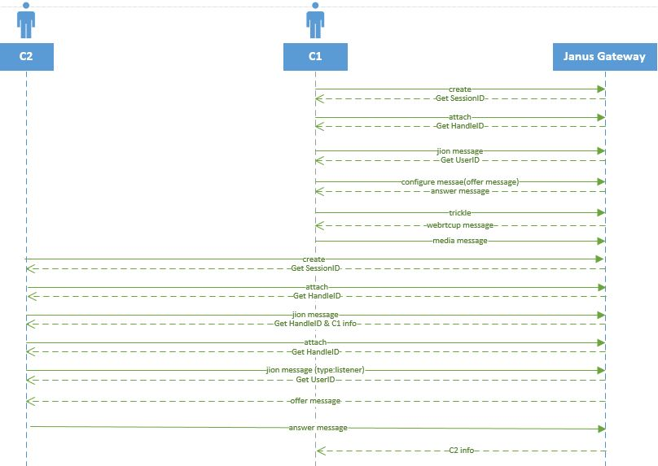

## VideoRoomDemo分析

### 协议



#### 过程

C1 和 C2两个客户端加入同一个房间过程分析。

##### C1跟Janus的交互

###### 创建会话

```json
# 请求
{"janus":"create","transaction":"Yoq052luvoNb"}
# 回复
{
   "janus": "success",
   "transaction": "Yoq052luvoNb", // 与请求的transaction对应
   "data": {
      "id": 1399990745526020    // 创建Session的ID
   }
}
```

###### 绑定插件

```json
# 请求
{
    "janus":"attach",
    "plugin":"janus.plugin.videoroom",
    "opaque_id":"videoroomtest-txC8XRmbGeFI",
    "transaction":"MNWgla6iggyx",
    "session_id":1399990745526020
}
# 回复
{
   "janus": "success",
   "session_id": 1399990745526020, // 标识SessionID
   "transaction": "MNWgla6iggyx",
   "data": {
      "id": 5059952639699198   // ICE HandleID
   }
}
```

###### 加入操作(插件自定义消息)

```json
# 请求
{
	"janus": "message",  	// message消息用于处理，之后返回结果(先返回ack消息)
	"body": {
		"request": "join",		// join操作
		"room": 1234,	    	// 房间号码	
		"ptype": "publisher",	// 数据推送方
		"display": "1"		    // 显示的客户端名字
	},
	"transaction": "7v4t90GXg2Gc",
	"session_id": 1399990745526020, // 标识SessionID
	"handle_id": 5059952639699198   // ICE HandleID
}

# 回复1
{
   "janus": "ack",                     // 异步消息先返回ack，表示我们已经收到请求
   "session_id": 1399990745526020,
   "transaction": "7v4t90GXg2Gc"
}
# 回复2
{				
	"janus": "event",				 // 异步消息处理返回结果
	"session_id": 1399990745526020, 		
	"sender": 5059952639699198,		  // 对于jion命令的ICE HandleID
	"transaction": "7v4t90GXg2Gc",
	"plugindata": {
		"plugin": "janus.plugin.videoroom",
		"data": {
			"videoroom": "joined",
			"room": 1234,
			"description": "Demo Room",
			"id": 6925547951565318,	  // UserID 标识该客户号
			"private_id": 871713189,
			"publishers": []		 // 这个时候因为没有其他人加入所有publisher为空
		}
	}
}
```

###### OFFER/ANSWER请求(交换C1和服务器的SDP)

```json
# 请求
{
	"janus": "message",
	"body": {
		"request": "configure",
		"audio": true,
		"video": true
	},
	"transaction": "5ExzsFmjOseZ",
	"jsep": {
		"type": "offer",  // offer请求
		"sdp": "v=0\r\no=mozilla...THIS_IS_SDPARTA-59.0.2 6314379243072097676 0 IN IP4 0.0.0.0\r\ns=-\r\nt=0 0\r\na=fingerprint:sha-256 83:83:FD:32:8A:BB:EB:EA:14:E9:35:05:9F:CE:6E:7C:5A:B8:C1:7B:4E:A8:3D:B4:A2:AA:93:F9:FD:30:99:67\r\na=group:BUNDLE sdparta_0 sdparta_1\r\na=ice-options:trickle\r\na=msid-semantic:WMS *\r\nm=audio 9 UDP/TLS/RTP/SAVPF 109 9 0 8 101\r\nc=IN IP4 0.0.0.0\r\na=sendonly\r\na=extmap:1 urn:ietf:params:rtp-hdrext:ssrc-audio-level\r\na=extmap:2 urn:ietf:params:rtp-hdrext:sdes:mid\r\na=fmtp:109 maxplaybackrate=48000;stereo=1;useinbandfec=1\r\na=fmtp:101 0-15\r\na=ice-pwd:3041994514b07dd6490108fb05cbc0cd\r\na=ice-ufrag:1b6f1a25\r\na=mid:sdparta_0\r\na=msid:{17620c7b-2939-41a6-9c0e-265692b1b27c} {e4f503a6-1e31-4b3a-901a-f54b9653d469}\r\na=rtcp-mux\r\na=rtpmap:109 opus/48000/2\r\na=rtpmap:9 G722/8000/1\r\na=rtpmap:0 PCMU/8000\r\na=rtpmap:8 PCMA/8000\r\na=rtpmap:101 telephone-event/8000/1\r\na=setup:actpass\r\na=ssrc:2210693729 cname:{a287e4ab-2d6b-422f-9e47-f13fe5a7d8f8}\r\nm=video 9 UDP/TLS/RTP/SAVPF 120 121 126 97\r\nc=IN IP4 0.0.0.0\r\na=sendonly\r\na=extmap:1 http://www.webrtc.org/experiments/rtp-hdrext/abs-send-time\r\na=extmap:2 urn:ietf:params:rtp-hdrext:toffset\r\na=extmap:3 urn:ietf:params:rtp-hdrext:sdes:mid\r\na=fmtp:126 profile-level-id=42e01f;level-asymmetry-allowed=1;packetization-mode=1\r\na=fmtp:97 profile-level-id=42e01f;level-asymmetry-allowed=1\r\na=fmtp:120 max-fs=12288;max-fr=60\r\na=fmtp:121 max-fs=12288;max-fr=60\r\na=ice-pwd:3041994514b07dd6490108fb05cbc0cd\r\na=ice-ufrag:1b6f1a25\r\na=mid:sdparta_1\r\na=msid:{17620c7b-2939-41a6-9c0e-265692b1b27c} {aa24abb0-eb1b-4dc2-93b2-5ce183a3e18a}\r\na=rtcp-fb:120 nack\r\na=rtcp-fb:120 nack pli\r\na=rtcp-fb:120 ccm fir\r\na=rtcp-fb:120 goog-remb\r\na=rtcp-fb:121 nack\r\na=rtcp-fb:121 nack pli\r\na=rtcp-fb:121 ccm fir\r\na=rtcp-fb:121 goog-remb\r\na=rtcp-fb:126 nack\r\na=rtcp-fb:126 nack pli\r\na=rtcp-fb:126 ccm fir\r\na=rtcp-fb:126 goog-remb\r\na=rtcp-fb:97 nack\r\na=rtcp-fb:97 nack pli\r\na=rtcp-fb:97 ccm fir\r\na=rtcp-fb:97 goog-remb\r\na=rtcp-mux\r\na=rtpmap:120 VP8/90000\r\na=rtpmap:121 VP9/90000\r\na=rtpmap:126 H264/90000\r\na=rtpmap:97 H264/90000\r\na=setup:actpass\r\na=ssrc:3929344155 cname:{a287e4ab-2d6b-422f-9e47-f13fe5a7d8f8}\r\n"
	},
	"session_id": 1399990745526020,
	"handle_id": 5059952639699198
}
# 服务端的ANSWER回复
{
	"janus": "event",
	"session_id": 1399990745526020,
	"sender": 5059952639699198,
	"transaction": "5ExzsFmjOseZ",
	"plugindata": {
		"plugin": "janus.plugin.videoroom",
		"data": {
			"videoroom": "event",
			"room": 1234,
			"configured": "ok",
			"audio_codec": "opus",  // ？
			"video_codec": "vp8"    // ？
		}
	},
	"jsep": {
		"type": "answer",  // ANSWER命令
		"sdp": "v=0\r\no=mozilla...THIS_IS_SDPARTA-59.0.2 1524620651577128 1 IN IP4 172.28.180.250\r\ns=VideoRoom 1234\r\nt=0 0\r\na=group:BUNDLE sdparta_0 sdparta_1\r\na=msid-semantic: WMS janus\r\nm=audio 9 UDP/TLS/RTP/SAVPF 109\r\nc=IN IP4 172.28.180.250\r\na=recvonly\r\na=mid:sdparta_0\r\na=rtcp-mux\r\na=ice-ufrag:GeeV\r\na=ice-pwd:oa7mkHO7tr0UckLXoCx5Ow\r\na=ice-options:trickle\r\na=fingerprint:sha-256 D2:B9:31:8F:DF:24:D8:0E:ED:D2:EF:25:9E:AF:6F:B8:34:AE:53:9C:E6:F3:8F:F2:64:15:FA:E8:7F:53:2D:38\r\na=setup:active\r\na=rtpmap:109 opus/48000/2\r\na=extmap:1 urn:ietf:params:rtp-hdrext:ssrc-audio-level\r\na=candidate:1 1 udp 2013266431 172.28.180.250 50885 typ host\r\na=end-of-candidates\r\nm=video 9 UDP/TLS/RTP/SAVPF 120\r\nc=IN IP4 172.28.180.250\r\na=recvonly\r\na=mid:sdparta_1\r\na=rtcp-mux\r\na=ice-ufrag:GeeV\r\na=ice-pwd:oa7mkHO7tr0UckLXoCx5Ow\r\na=ice-options:trickle\r\na=fingerprint:sha-256 D2:B9:31:8F:DF:24:D8:0E:ED:D2:EF:25:9E:AF:6F:B8:34:AE:53:9C:E6:F3:8F:F2:64:15:FA:E8:7F:53:2D:38\r\na=setup:active\r\na=rtpmap:120 VP8/90000\r\na=rtcp-fb:120 ccm fir\r\na=rtcp-fb:120 nack\r\na=rtcp-fb:120 nack pli\r\na=rtcp-fb:120 goog-remb\r\na=rtcp-fb:120 transport-cc\r\na=candidate:1 1 udp 2013266431 172.28.180.250 50885 typ host\r\na=end-of-candidates\r\n"
	}
}
```

###### trickle

```json
# 进行多次操作
{
	"janus": "trickle",
	"candidate": {
		"candidate": "candidate:0 1 UDP 2122252543 172.28.104.225 47594 typ host",
		"sdpMid": "sdparta_0",
		"sdpMLineIndex": 0
	},
	"transaction": "fFfeQu9JqdR9",
	"session_id": 1399990745526020,
	"handle_id": 5059952639699198
}
```

##### Janus跟C1交互

```json
# ICE和DTLS成功了，因此Janus正确地建立了与用户/应用程序的PeerConnection
{
	"janus": "webrtcup",
	"session_id": 1399990745526020,
	"sender": 5059952639699198
}
# 接收音频
{
	"janus": "media",
	"session_id": 1399990745526020,
	"sender": 5059952639699198,
	"type": "audio",
	"receiving": true
}
# 接收视频
{
   "janus": "media",
   "session_id": 1399990745526020,
   "sender": 5059952639699198,
   "type": "video",
   "receiving": true
}
```

至此，通道打通但是没有发送任何媒体数据。

##### C2跟Janus的交互

C2前面的操作跟C1类似，但是C2的**加入操作** 返回结果有区别(因为房间里面已经存在C1)

```json
{
	"janus": "event",
	"session_id": 1702249662424488,   		// C2的SessionID
	"sender": 5178562342823551,			    // C2的ICE HandleID	
	"transaction": "8P9ENwV0hcGl",
	"plugindata": {
		"plugin": "janus.plugin.videoroom",
		"data": {
			"videoroom": "joined",
			"room": 1234,
			"description": "Demo Room",
			"id": 2216285399709130,			// C2的UserID
			"private_id": 807602628,
			"publishers": [{       			// 已经存在的成员数组
				"id": 6925547951565318,
				"display": "1",
				"audio_codec": "opus",
				"video_codec": "vp8",
				"talking": false
			}]
		}
	}
}
```

当检测到有其他成员存在，C2需要创建新的ICE去接收该成员的数据，即发起attach请求

```json
# 请求
{
	"janus": "attach",
	"plugin": "janus.plugin.videoroom",
	"opaque_id": "videoroomtest-kMndyKe8S5Ht",
	"transaction": "E6lIEz6qzznY",
	"session_id": 1702249662424488
}
# 回复
{
	"janus": "success",
	"session_id": 1702249662424488,
	"transaction": "E6lIEz6qzznY",
	"data": {
		"id": 1645387239085397	# 新的ICE HandleID
	}
}
```

##### C2的接收数据成员加入

```json
# 加入
{
	"janus": "message",
	"body": {
		"request": "join",
		"room": 1234,
		"ptype": "listener",   // 数据接收方
		"feed": 6925547951565318, // 需要接收数据方的ICE HandleID
		"private_id": 807602628
	},
	"transaction": "I6o6LCHefcS2",
	"session_id": 1702249662424488,
	"handle_id": 1645387239085397
}
```

##### Janus与C2交互

```json
# Janus向C2发起OFFER请求
{
	"janus": "event",
	"session_id": 1702249662424488,
	"sender": 1645387239085397,
	"transaction": "I6o6LCHefcS2",
	"plugindata": {
		"plugin": "janus.plugin.videoroom",
		"data": {
			"videoroom": "attached",
			"room": 1234,
			"id": 6925547951565318,
			"display": "1"
		}
	},
	"jsep": {
		"type": "offer",
		"sdp": "v=0\r\no=- 1524620651577072 1 IN IP4 172.28.180.250\r\ns=VideoRoom 1234\r\nt=0 0\r\na=group:BUNDLE audio video\r\na=msid-semantic: WMS janus\r\nm=audio 9 UDP/TLS/RTP/SAVPF 111\r\nc=IN IP4 172.28.180.250\r\na=sendonly\r\na=mid:audio\r\na=rtcp-mux\r\na=ice-ufrag:yeT8\r\na=ice-pwd:kjoPgwfkAoyzBh9j3zLM9M\r\na=ice-options:trickle\r\na=fingerprint:sha-256 D2:B9:31:8F:DF:24:D8:0E:ED:D2:EF:25:9E:AF:6F:B8:34:AE:53:9C:E6:F3:8F:F2:64:15:FA:E8:7F:53:2D:38\r\na=setup:actpass\r\na=rtpmap:111 opus/48000/2\r\na=extmap:1 urn:ietf:params:rtp-hdrext:ssrc-audio-level\r\na=ssrc:3301301108 cname:janusaudio\r\na=ssrc:3301301108 msid:janus janusa0\r\na=ssrc:3301301108 mslabel:janus\r\na=ssrc:3301301108 label:janusa0\r\na=candidate:1 1 udp 2013266431 172.28.180.250 42992 typ host\r\na=end-of-candidates\r\nm=video 9 UDP/TLS/RTP/SAVPF 96\r\nc=IN IP4 172.28.180.250\r\na=sendonly\r\na=mid:video\r\na=rtcp-mux\r\na=ice-ufrag:yeT8\r\na=ice-pwd:kjoPgwfkAoyzBh9j3zLM9M\r\na=ice-options:trickle\r\na=fingerprint:sha-256 D2:B9:31:8F:DF:24:D8:0E:ED:D2:EF:25:9E:AF:6F:B8:34:AE:53:9C:E6:F3:8F:F2:64:15:FA:E8:7F:53:2D:38\r\na=setup:actpass\r\na=rtpmap:96 VP8/90000\
		r\na=rtcp-fb:96 ccm fir\r\na=rtcp-fb:96 nack\r\na=rtcp-fb:96 nack pli\r\na=rtcp-fb:96 goog-remb\r\na=ssrc:1210358559 cname:janusvideo\r\na=ssrc:1210358559 msid:janus janusv0\r\na=ssrc:1210358559 mslabel:janus\r\na=ssrc:1210358559 label:janusv0\r\na=candidate:1 1 udp 2013266431 172.28.180.250 42992 typ host\r\na=end-of-candidates\r\n"
	}
}

# C2以ANSWER方式回复
{
	"janus": "message",
	"body": {
		"request": "start",
		"room": 1234
	},
	"transaction": "oOpKWp5WGzG3",
	"jsep": {
		"type": "answer",
		"sdp": "v=0\r\no=mozilla...THIS_IS_SDPARTA-59.0.2 3111183838337106441 0 IN IP4 0.0.0.0\r\ns=-\r\nt=0 0\r\na=fingerprint:sha-256 5E:B4:73:4A:1B:50:9B:92:6C:A8:C3:83:12:6A:10:41:91:8A:99:6F:FC:6D:BF:80:D2:10:5E:9B:C4:3B:D9:AE\r\na=group:BUNDLE audio video\r\na=ice-options:trickle\r\na=msid-semantic:WMS *\r\nm=audio 9 UDP/TLS/RTP/SAVPF 111\r\nc=IN IP4 0.0.0.0\r\na=recvonly\r\na=extmap:1 urn:ietf:params:rtp-hdrext:ssrc-audio-level\r\na=fmtp:111 maxplaybackrate=48000;stereo=1;useinbandfec=1\r\na=ice-pwd:b93ff4e6a12616c3abef36d95df67e82\r\na=ice-ufrag:5914b9f4\r\na=mid:audio\r\na=rtcp-mux\r\na=rtpmap:111 opus/48000/2\r\na=setup:active\r\na=ssrc:3155733976 cname:{33d03ec5-57cb-4fa9-8b73-606011640e06}\r\nm=video 9 UDP/TLS/RTP/SAVPF 96\r\nc=IN IP4 0.0.0.0\r\na=recvonly\r\na=fmtp:96 max-fs=12288;max-fr=60\r\na=ice-pwd:b93ff4e6a12616c3abef36d95df67e82\r\na=ice-ufrag:5914b9f4\r\na=mid:video\r\na=rtcp-fb:96 nack\r\na=rtcp-fb:96 nack pli\r\na=rtcp-fb:96 ccm fir\r\na=rtcp-fb:96 goog-remb\r\na=rtcp-mux\r\na=rtpmap:96 VP8/90000\r\na=setup:active\r\na=ssrc:2808316286 cname:{33d03ec5-57cb-4fa9-8b73-606011640e06}\r\n"
	},
	"session_id": 1702249662424488,
	"handle_id": 1645387239085397    // 发送方的OFFER
}
```

##### C2跟Janus的交互

**webrtcup**操作完成之后，Janus通知C1，C2加入成功。

```json
{
	"janus": "event",
	"session_id": 1399990745526020,
	"sender": 5059952639699198,
	"plugindata": {
		"plugin": "janus.plugin.videoroom",
		"data": {
			"videoroom": "event",
			"room": 1234,
			"publishers": [{
				"id": 2216285399709130,
				"display": "2",
				"audio_codec": "opus",
				"video_codec": "vp8"
			}]
		}
	}
}

# 之后操作跟C2发现有C1存在类似
```


